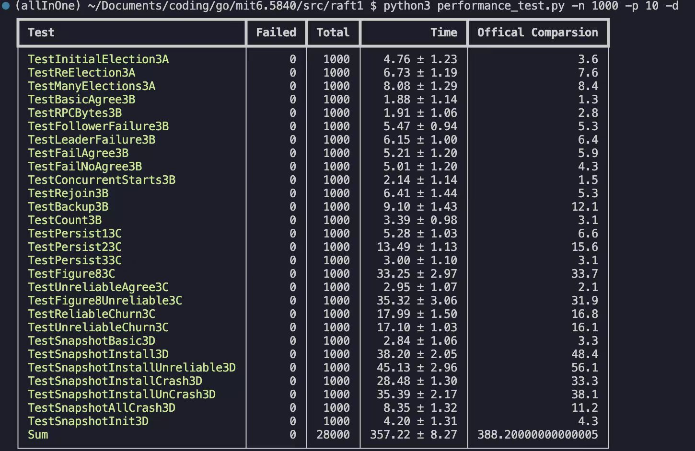

# MIT6.5840(6.824) Distribufted System

## 项目简介
- 课程项目：MIT6.5840 2025 Spring，原MIT6.824
- 编程语言：Go
- 所属大学：麻省理工学院

## 本人工作
完成前4个lab，并对raft协议部分单独提供功能增加的压测文件
- [x] lab1 map reduce
- [x] lab2 key/value server
- [x] lab3 raft
- [x] lab4 fault-tolerant key/value service
- [ ] lab5 sharded key/value service

--------
[压测文件](https://gist.github.com/JJGO/0d73540ef7cc2f066cb535156b7cbdab)功能增强
- [x] 增加raft协议所有test的自动拆分功能
- [x] 增加开启debug输出模式
- [x] 增加官方数据比对
- [x] 增加测试时动态显示失败任务数
- [x] 增加汇总功能
- [ ] 动态刷新频率问题优化

--------
修复官方bug
- [x] 修复一个并发安全bug
- [x] 修复一个逻辑bug

## 环境依赖
- **OS**: Linux/MacOs
- **Go**: 1.24.2
- **Python**: 3.8
    - 依赖包：typer和rich

## 安装与压测

1. **克隆**
```bash
git clone git@github.com:Ver-zil/mit6.5840.git
cd mit6.5840
```

2. **配置python环境**
```bash
conda activate [your_python_env]
pip install typer rich
```

3. **压测raft**
```bash
cd src/raft1
python3 performance_test.py
```

4. **压测结果**




5. **小结**

虽然所有test均能稳定通过，但是不保证代码一定不存在bug。且在极端的情况下，比如2s内因陷入循环等待而无法选出leader，test也会不通过，但是不代表一致性就遭到了破坏，这种极端情况发生的概率极小，但是笔者真的遇到过。

## TODO
- [ ] lab5 sharded key/value service
- [ ] 压测文件优化刷新频率问题
- [ ] 代码可读性优化


## 课程资源
- 课程网站: https://pdos.csail.mit.edu/6.824/schedule.html
- 课程翻译: https://mit-public-courses-cn-translatio.gitbook.io/mit6-824/
- 其他资源: [部分论文](./doc/paper/)、[lab描述](./doc/lab-desc/)
- 课程作业: 
```bash
git clone git://g.csail.mit.edu/6.5840-golabs-2025 6.5840
```
<!-- 
## 文件结构介绍
- doc
    - lab-desc：2025spring课程所有的lab描述
    - log：存放部分个人认为有意义的bug，结构比较混乱
    - paper：存放目前为止本人读过的课程相关paper
    - img：存放md需要的图片 -->

## 后记

笔者白天在大厂上班，晚上来写这个lab，说实话写的实在是有一点崩溃了，debug只能通过log来排查问题，得自己通脑补过程来排查bug大致是什么原因导致的，而且分布式的环境随机性实在是太强了，稍微一个不注意就发生点奇怪的bug，任何能想到的，可能会发生bug的地方，都应该极力避免，因为还有很多你想不到的bug，比如官方可能自己都没注意自己写了一些bug上去。
笔者在写这个lab的时候，起步阶段参考了不少网络上的资料，因为lab需要在Linux/MacOs下才能跑起来，vscode用的也不多，光是配置环境就花费了不少时间，写lab的时候，刚开始连需要做什么都没有完全搞清楚，所以每个lab在刚开始写的阶段，都或多或少的参考了一些别人的，但是代码都是自己写的，虽然不少人强调一定要自己独立完成，但是到底如何执行的都不重要，重点在于学下去，如果刚开始因为配环境或者不知道从哪里开始写这种事情而放弃是多么的可惜，学习知识在于学习本身，而不是其他，只要别人的工作能帮助你去理解这些东西，那就去参考，站在巨人的肩膀上并不是一件可耻的事情，笑到最后的人才是赢家。